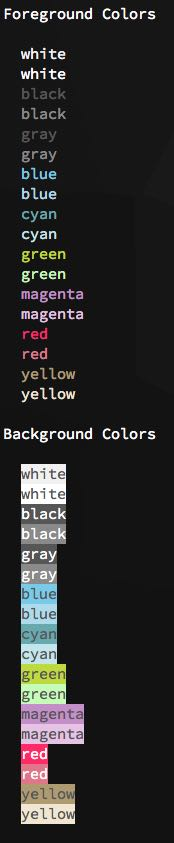
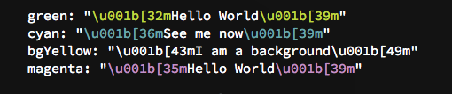

# colorz
[![NPM version][npm-image]][npm-url]
[![schoolmarm-standard-style][marm-image]][marm-url]
[![experimental][stability-image]][stability-url]
[![Downloads][downloads-image]][downloads-url]

> Ansi escaped color styling for the console/terminal

## Why?
It loads fast. It runs fast. It's lightweight. It has no dependencies. I wanted to learn.

## Installation
```bash
$ npm install colorz
```

## Usage

see the [example.js](example.js) for further usage

```js
var colorz = require('colorz')

colorz.red('because')
colorz.brRed('because')
colorz.green('because')
colorz.brGreen('because')
colorz.magenta('becaaaausssse')
colorz.cyan('because')
colorz.white('of')
colorz.gray('the')
colorz.inverse('wonderful')
colorz.black('things')
colorz.strikethrough('he')
colorz.red('does')
colorz.bgRed('da da da da da da da, dum dum')
colorz.underline(colorz.cyan('we\'re off to see the wizard'))
colorz.dim('the wonderful wizard of OZ!')
colorz.bold('hello world')

// you can also make things a bit easier for yourself 
const red = colorz.red
const blu = colorz.blue
// etc, etc.

console.log(red('Hello World'))
```



## API
#### `.[style](msg)`
Enter a syle and your text message, i.e., `colorz.inverse('Hello')`

List of styles used by the API
**modifiers**  
  reset         
  bold          
  dim           
  italic        
  underline     
  inverse       
  hidden        
  strikethrough 
  
**foregrounds**  
  black         
  gray          
  grey          
  red           
  green         
  yellow        
  blue          
  magenta       
  cyan          
  white         
  
**bright foregrounds**  
  brBlack       
  brGray        
  brGrey        
  brRed         
  brGreen       
  brYellow      
  brBlue        
  brMagenta     
  brCyan        
  brWhite       
  
**backgrounds**  
  bgBlack       
  bgGray        
  bgGrey        
  bgRed         
  bgGreen       
  bgYellow      
  bgBlue        
  bgMagenta     
  bgCyan        
  bgWhite       
  
**bright backgrounds**  
  bbBlack       
  bbGray        
  bbGrey        
  bbRed         
  bbGreen       
  bbYellow      
  bbBlue        
  bbMagenta     
  bbCyan        
  bbWhite       

#### `.strip(ansiDecoratedTextMsg)`
Strip the ansi escaped sequences off the text   

```js
var text = colorz.cyan('Hello')
console.log(colorz.strip(text))
// --> Hello
```

#### `.expose(color:STRING[, text:STRING, noColor:BOOLEAN])`
Expose the ansi escape strings in color (default) 

```js
console.log(colorz.expose('green'))
console.log(colorz.expose('cyan', 'See me now'))
console.log(colorz.expose('bgYellow', 'I am a background', true))
console.log(colorz.expose('magenta', false))
```



## See Also
There are many ansi escape terminal coloring applications running in the wild. Here are a few to start with:   
- [chalk](https://www.npmjs.com/package/chalk). Terminal string styling done right. Much color.  
- [colors](https://www.npmjs.com/package/colors). get colors in your node.js console  
- [colour.js](https://github.com/dcodeIO/colour.js). A cored, fixed, documented and optimized version of the popular `colors.js`  
- [neocolor](https://www.npmjs.com/package/neocolor). Minimal library for colored console output  
- [ansi-wrap](https://www.npmjs.com/package/ansi-wrap). Create ansi colors by passing the open and close codes.  
- [clor](https://github.com/bucaran/clor). Sexy terminal styles   
- [colorful](https://github.com/lepture/colorful). colorful environment for command line tools in node  


## License
[ISC](https://tldrlegal.com/license/ISC-license)

[npm-image]: https://img.shields.io/npm/v/colorz.svg?style=flat-square
[npm-url]: https://npmjs.org/package/colorz
[marm-image]: https://img.shields.io/badge/code%20style-marm-brightgreen.svg?style=flat-square
[marm-url]: https://github.com/akileez/eslint-config-marm
[stability-image]: https://img.shields.io/badge/stability-experimental-orange.svg?style=flat-square
[stability-url]: https://github.com/akileez/colorz
[downloads-image]: http://img.shields.io/npm/dm/colorz.svg?style=flat-square
[downloads-url]: https://npmjs.org/package/colorz
